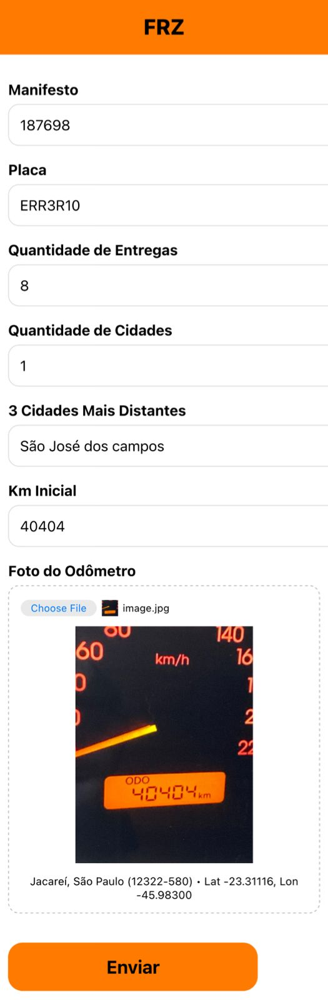

# 🌏 Geolocation collector

In this project, I was commissioned by FRZ, a local company from São José dos Campos - São Paulo, Brazil, to develop a system to help them gain more precise control over their delivery service. The system replaces their manual process of transcribing physical forms into Google Sheets with an automated solution that sends all information online and formats it directly into their Google Sheet. It also provides more accurate tracking of driver locations and the kilometers they complete, reducing errors and lowering company costs.. 

---

## 📝 Project Overview

The system works as a lightweight web application where users have to answer two forms. The first form collects key details: trip identification, license plate, quantity of deliveries and cities, the farthest city, and the odometer reading before departure. The driver also uploads a photo of the odometer, which automatically captures their location. The second form record trip completion data, including any returns, the final odometer reading, and another photo with geolocation. All data is instantly processed and sent to Google Sheets. 

---

## 🖼️ Preview



---

## 🖥️ Project Structure
```
FRZ-System/
│── Pictures/ # Project view
│── README.md # Project documentation
│── header.css # CSS stylesheet
│── index.html # Main HTML file
│── main.js # JavaScript file with the main functions
```
---

## 🛠️ Built With

- **Website** – JavaScript, HTML, CSS
- **Data Base** – Getform
- **Others** – Google Sheets

---

## 🌐 Clone the repository
```bash
git clone https://github.com/DerikFlamel/FRZ-System.git
```
